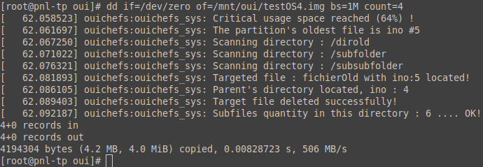

## Batterie de tests

|                                                                                                           | après création | après reboot   |
| --------------------------------------------------------------------------------------------------------- | -------------- | -------------- |
| dossier plein                                                                                             | dossier plein  | dossier plein  |
| détection maximum files                                                                                   | OK             | OK             |
| suppression du plus ancien (ino6) du dossier                                                              | OK             | OK             |
|                                                                                                           |                |                |
| changement de politique (insmod)                                                                          | OK             | OK             |
| détection maximum files                                                                                   | OK             | OK             |
| suppression du plus gros du dossier                                                                       | OK             | OK             |
| suppression du plus gros du dossier même si ils sont tous à 0 bytes (choix arbitraire du premier fichier) | OK             | OK             |
| non suppression si i_count trop grand                                                                     | OK             | OK             |
| non suppression si c'est un directory                                                                     | OK             | OK             |
| STRESS TEST : création de 256 fichiers à la suite dans un dossier, on doit retrouver les 128 dernier      | OK             | OK             |
|                                                                                                           |                |                |
| PARTITION FULL                                                                                            | PARTITION FULL | PARTITION FULL |
| calcul et affichage du % libre                                                                            | OK             | OK             |
| détection du fichier le plus ancien (ino5) via la recherche dans le BITMAP                                | OK             | OK             |
| détection du DIR PARENT quand pas de dentry par fonction recursive du parcours de l'arboresence.          | NA             | OK             |
| suppression quand un dentry est présent                                                                   | OK             | NA             |
| suppression sans dentry (détection parent)                                                                | NA             | OK             |
| Mêmes tests réalisés avec le changement de politique                                                      | OK             | OK             |
| STRESS TEST : création de 50 fichiers de 4Mo à la suite, on doit garder un free space d'environ 70%       | OK             | OK             |

Résultat de la localisation du fichier avec modification la plus ancienne, puis de sa suppression. (réglage du free space minimum à 70%)

Résultat de la localisation du fichier le plus gros et puis sa suppression (réglage du free space minimum à 70%)

