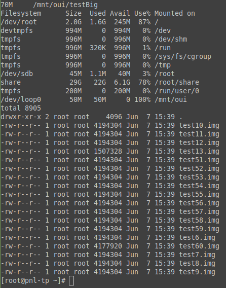

# Batterie de tests

## Récapitulatif

Nous avons écris un script SSH `test_bench.sh` nous permettant de faire des tests précis et répétable facilement.

|                                                                                                                                       | après création (avec dentry) | après reboot(sans dentry) |
| ------------------------------------------------------------------------------------------------------------------------------------- | ---------------------------- | ------------------------- |
| REPERTOIRE PLEIN                                                                                                                      |                              |                           |
| détection maximum files                                                                                                               | OK                           | OK                        |
| suppression du plus ancien (ino6) du dossier                                                                                          | OK                           | OK                        |
| ajout d'un fichier ou dossier du meme nom que celui supprimé auparavant                                                               | OK                           | OK                        |
| changement de politique (insmod)                                                                                                      | OK                           | OK                        |
| détection maximum files (128)                                                                                                         | OK                           | OK                        |
| détection maximum directories (128)                                                                                                   | OK                           | OK                        |
| impossibilité de supprimé l'ino 0                                                                                                     | OK                           | OK                        |
| impossibilité de supprimé un dossier                                                                                                  | OK                           | OK                        |
| suppression du plus gros du fichier                                                                                                   | OK                           | OK                        |
| suppression du plus gros du fichier même si ils sont tous à 0 bytes (a taille égale, choix du plus anciennement modifié)              | OK                           | OK                        |
| non suppression si i_count trop grand                                                                                                 | OK                           | OK                        |
| STRESS TEST : création de 10000 fichiers à la suite dans un dossier, on doit retrouver les fichier numérotés de 10000 à 9873 derniers | OK                           | OK                        |
|                                                                                                                                       |                              |                           |
| **PARTITION PLEINE**                                                                                                                  | **après création**           | **après reboot**          |
| calcul et affichage du % libre                                                                                                        | OK                           | OK                        |
| détection du fichier le plus ancien (ino5) via la recherche dans le BITMAP                                                            | OK                           | OK                        |
| détection du DIR PARENT quand pas de dentry par fonction recursive du parcours de l'arboresence.                                      | NA                           | OK                        |
| suppression quand un dentry est présent                                                                                               | OK                           | NA                        |
| suppression sans dentry (détection parent)                                                                                            | NA                           | OK                        |
| Mêmes tests réalisés avec le changement de politique                                                                                  | OK                           | OK                        |
| STRESS TEST : création de 50 fichiers de 4Mo à la suite, on doit garder un free space d'environ 70%                                   | IMPOSSIBLE BUG OUICHEFS      | IMPOSSIBLE BUG OUICHEFS   |

## Screenshots

Résultat de la <u>localisation du fichier avec modification la plus ancienne</u>, puis de sa suppression. (réglage du free space minimum à 70%)

Résultat de la <u>localisation du fichier le plus gros et de son parent dans l'arborescence et puis sa suppression</u> (réglage du free space minimum à 70%)

## BUG de OUIECHFS

Notre batterie de test à révéler un bug dans ouichefs. En effet, il est possible de créer et de stocker dans un dossier de la partition plus de données que la taille de la partition entière.

On voir sur le screenshot ci-dessus <u>le ouichefs de référence</u>. On stocke 70Mo dans le dossier /testBig alors que la partition fait 50Mo au total et qu'elle est notée comme 100% pleine.

Pour reproduire ce bug <u>sur le ouichefs original</u>, nous avons joint un script `bugouichefs.sh`.
